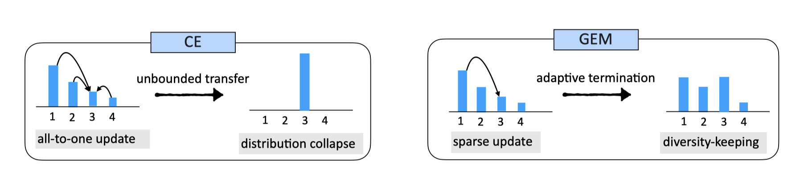
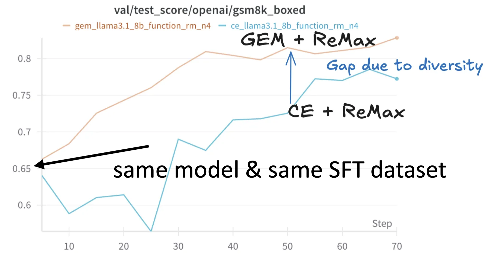

# 🚀 PyTorch Implementation of GEM 🌟

Welcome to the official PyTorch implementation of **GEM**! 🎉

GEM was introduced in our [ICLR 2025 paper](https://openreview.net/forum?id=dulz3WVhMR) **"Preserving Diversity in Supervised Fine-tuning of Large Language Models"**. 

> This work was previously titled "Entropic Distribution Matching in Supervised Fine-tuning of LLMs: Less Overfitting and Better Diversity" and received the Best Paper Runner-up Award at the NeurIPS 2024 FITML Workshop.



GEM can replace the CE loss during SFT (supervised fine-tuning) or RFT (reinforced fine-tuning) to preserve diversity and mitigate overfitting. 🌍✨ 

For an overview of GEM, please refer to our [presentation slides](docs/GEM-2025-03-23.pdf).

For more insights on GEM's potential to enhance RL training through improved cold-start strategies, check out our blog post: ["Can Better Cold-Start Strategies Improve RL Training for LLMs?"](https://tangible-polo-203.notion.site/Can-Better-Cold-Start-Strategies-Improve-RL-Training-for-LLMs-17aa0742a51680828616c867ed53bc6b)



## Quickstart Guide 💻

### Setup 🔧

First, create a new environment and install the required packages:

```bash
conda create -n gem python=3.10
conda activate gem
pip install -r requirements.txt
```

Note that the version of packages in `requirements.txt` is used in the paper. You may use a higher version of transformers (>= 4.46.0) that fixes the potential bug of gradient accumulation.

We also provide a **Triton** implementation of GEM loss in the `utils` folder, which may be faster than the original implementation when training large-scale models. Please refer to the [README](utils/README.md) for more details. You may use this implementation with the following command:

```bash
python train.py --loss gem_triton
```


### Training 🏋️‍♂️

Kickstart your training process using the `UltraFeedback` dataset from HuggingFace. Here's how:

**Tokenize Data**

```bash
bash scripts/tokenize_data.sh
```

**Training**

```bash
bash scripts/train_gem_ultrafeedback.sh
```

> **Note:** The `ce_loss` metric in training logs represents the cross-entropy loss calculated on a single machine without accounting for gradient accumulation. This value may differ from the reported `loss` metric. When monitoring training progress, you can use `ce_loss` as a diagnostic indicator to verify proper training behavior—the cross-entropy loss should decrease over time regardless of whether you're using CE or GEM as your primary loss function.

### Evaluation 🧪

Run evaluations for different tasks:

**GSM8K**

```bash 
bash scripts/eval/gsm8k_eval.sh
```

**GSM8K (Voting)**

```bash
bash scripts/eval/gsm8k_voting_eval.sh
```

**Creative Writing**

```bash
bash scripts/eval/creative_writing.sh
```

## To Do

- [ ] Add the adaptive mechanism for choosing the hyper-parameter $\beta$.

## 📜 Citation

If you find this repository helpful in your research or projects, please consider citing the GEM paper in your academic work. Your support is much appreciated! 🙌


```
@inproceedings{li2025preserving,
  title={Preserving Diversity in Supervised Fine-Tuning of Large Language Models},
  author={Ziniu Li and Congliang Chen and Tian Xu and Zeyu Qin and Jiancong Xiao and Zhi-Quan Luo and Ruoyu Sun},
  booktitle={The Thirteenth International Conference on Learning Representations},
  year={2025},
  url={https://openreview.net/forum?id=NQEe7B7bSw}
}
```

Our work was previously titled "Entropic Distribution Matching in Supervised Fine-tuning of LLMs: Less Overfitting and Better Diversity", available on arXiv.

```bibtex
@article{li2024entropic,
  title={Entropic Distribution Matching in Supervised Fine-tuning of LLMs: Less Overfitting and Better Diversity},
  author={Li, Ziniu and Chen, Congliang and Xu, Tian and Qin, Zeyu and Xiao, Jiancong and Sun, Ruoyu and Luo, Zhi-Quan},
  journal={arXiv preprint arXiv:2408.16673},
  year={2024}
}
```

Ziniu Li would like to acknowledge Zhengyang Tang for his minimalistic and clean implementation of SFT.
